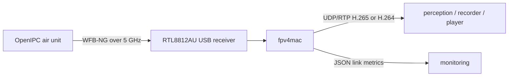

# fpv4mac

Native macOS ground receiver tooling for OpenIPC and WFB-NG video links.

> **Project status:** pre-alpha hardware bring-up. USB discovery and the pinned upstream raw-radio
> backend are validated on Apple Silicon. Native WFB-NG recovery and RTP forwarding are next.

## Purpose

`fpv4mac` turns a supported USB FPV radio receiver into a standard local RTP stream without
requiring a video-player UI. It is intended to compose with GStreamer, FFmpeg, computer-vision
services, recording tools, and dashboards.



The project deliberately stops at the RTP boundary. Camera decoding, object detection, user
interfaces, and mission logic belong in downstream applications.

## Current hardware target

- Realtek RTL8812AU (`0bda:8812`)
- Apple Silicon macOS
- RunCam WiFiLink 2 / OpenIPC WFB-NG transmitters

The receiver backend will use [OpenIPC devourer](https://github.com/OpenIPC/devourer), the
project's cross-platform userspace Realtek driver, instead of introducing a macOS kernel driver.

## Build

```bash
brew install cmake pkgconf libusb
cmake -S . -B build
cmake --build build -j
ctest --test-dir build --output-on-failure
```

## Diagnose a receiver

Connect the USB receiver and run:

```bash
./build/fpv4mac doctor
./build/fpv4mac doctor --json
```

`doctor` opens the receiver, claims interface 0, and immediately releases it. It does not tune
the radio, transmit data, or alter persistent system configuration.

Exit codes:

- `0`: a compatible receiver is ready
- `2`: no compatible receiver was found
- `3`: a receiver was found but could not be opened or claimed

If macOS can see the adapter but `doctor` cannot, run it from a normal Terminal session rather
than a sandboxed development host. See [hardware validation](docs/hardware-validation.md).

## Raw-radio smoke test

The current bridge to the radio backend is a reproducible, revision-pinned build of OpenIPC
`devourer`:

```bash
scripts/build-devourer.sh
scripts/radio-smoke-test.sh 161
```

This initializes the RTL8812AU and counts raw frames on the selected channel. It does not yet
recover or output video. Stop it before running `doctor`, because exactly one process can own the
USB receiver.

## Direction

1. USB readiness probe
2. `devourer` monitor-mode receive on a configured channel
3. WFB-NG session authentication, decryption, and FEC recovery
4. Unmodified RTP forwarding to a configurable UDP destination
5. Link-health JSON output and repeatable packet-capture fixtures
6. Signed/notarized Apple Silicon releases

See [the architecture](docs/architecture.md), [receiver contract](docs/receiver-contract.md),
[hardware validation](docs/hardware-validation.md), and [roadmap](docs/roadmap.md).

## License

Original `fpv4mac` code is available under the MIT License. Dependencies retain their own
licenses. In particular, OpenIPC `devourer` is GPL-2.0; redistribution of a combined or linked
work must satisfy the licenses of every component.
