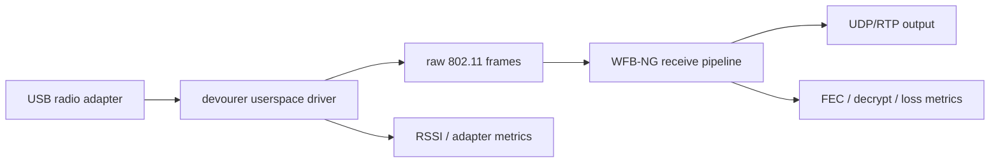

# Architecture

## Boundaries



`fpv4mac` owns the USB adapter and radio-link processing. It does not own video decoding or a
display window. This keeps the receiver reusable by OpenIPC operators and by headless services.

## Rules

1. Exactly one process owns a USB receiver at a time.
2. The receiver never silently detaches an active macOS driver. Diagnostics report conflicts.
3. Decrypted payloads are forwarded without transcoding.
4. Packet queues are bounded; stale video must not create unbounded latency.
5. Encryption keys are read from explicit paths and never printed or included in metrics.
6. Loss, FEC recovery, decrypt errors, RTP sequence gaps, and last-packet age remain observable.
7. Hardware loss and reconnection do not require downstream consumers to restart.
8. The first stable output is local UDP/RTP; RTSP/WebRTC are downstream gateway concerns.

## Dependency direction

The planned receiver layers are:

```text
CLI/configuration
      |
receiver session + metrics
      |
WFB-NG recovery
      |
OpenIPC devourer
      |
libusb
```

The application layer may depend on the layers below it. Radio and protocol layers must not
depend on a player, dashboard, computer-vision framework, or drone-control service.

## Dependency pinning

The bring-up script pins OpenIPC `devourer` to
`ebe9f9517fb9fab402808c27b0ab6640874207e6`. It builds only the Jaguar1 backend needed by the
initial RTL8812AU target. This repeatable external build is the first integration seam; the
receiver-session library will replace the smoke-test executable as its API is stabilized.
