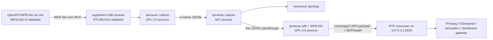

# Architecture

## Boundaries



The three processes are joined with pipes, which provides a stable interface and preserves their
license boundaries. `devourer` owns the adapter. The MIT command records and replays radio frames.
The GPL bridge performs WFB-NG authentication, decryption, deduplication, and FEC recovery before
forwarding the original payload as UDP. No stage decodes or transcodes video.

In automatic mode, the WFB bridge derives bounded candidate channel IDs from the WFB source
address convention. A candidate becomes active only when WFB-NG authenticates its session using
the supplied ground key. RTP inspection is metadata-only: it detects a strong H.264/H.265 marker,
counts sequence gaps, and writes SDP without modifying media packets.

## Rules

1. Exactly one process owns a USB receiver at a time.
2. The receiver never silently detaches an active macOS driver. Diagnostics report conflicts.
3. Decrypted payloads are forwarded without transcoding.
4. Packet queues are bounded; stale video must not create unbounded latency.
5. Encryption keys are read from explicit paths and never printed or included in metrics.
6. Loss, FEC recovery, decrypt errors, RTP sequence gaps, and last-packet age remain observable.
7. Hardware loss and reconnection do not require downstream consumers to restart.
8. The first stable output is local UDP/RTP; RTSP/WebRTC are downstream gateway concerns.

## Dependency direction

The live receiver stages are:

```text
RTL8812AU -> devourer -> JSONL -> fpv4mac capture -> JSONL -> fpv4mac-wfb -> UDP
```

The boundary after `fpv4mac-wfb` is intentionally ordinary UDP. A local player, dashboard gateway,
or perception service may listen there without knowing anything about the radio or WFB protocol.
Those downstream consumers remain outside this repository.

## Dependency pinning

The bring-up script pins OpenIPC `devourer` to
`ebe9f9517fb9fab402808c27b0ab6640874207e6`. It builds only the Jaguar1 backend needed by the
initial RTL8812AU target. This repeatable external build is the first integration seam; the
receiver consumes `rxdemo`'s machine-readable stream without linking GPL-2.0 code into the MIT
binary. WFB-NG is separately pinned by `scripts/build-wfb-bridge.sh`.
